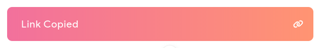
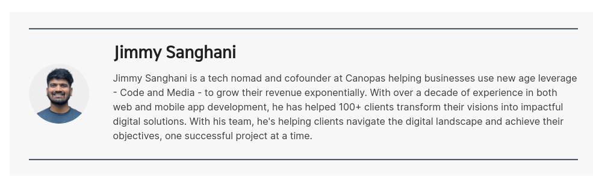
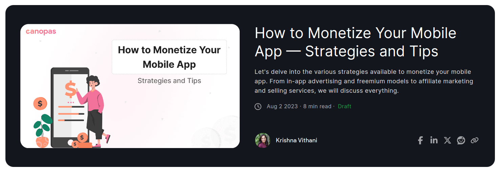
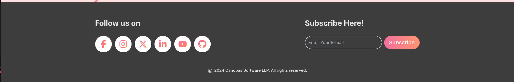
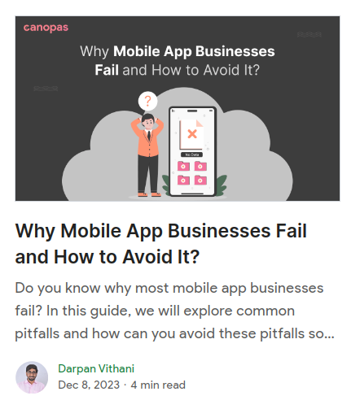
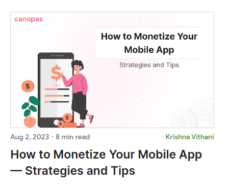
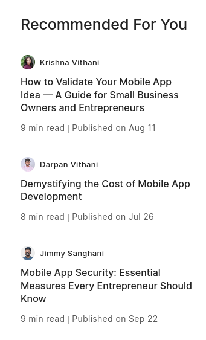
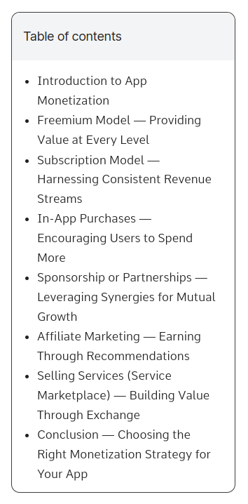
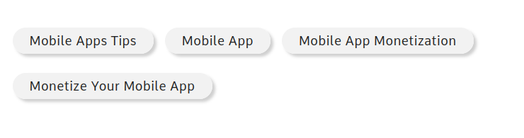

# All components provided by this library

## Fields of post object

**Note:** `*` fields are required

- id\* : Id of post
- slug\* : Unique identifier with dashed format of post title(i.e. this-is-post-slug)
- title\* : Title of post
- summary\* : Summary of Post
- content\* : Content of Post in HTML format
- toc : Table of Content in HTML format
- reading_time\* : Total reading time in minutes
- published_on\* : Published date of post
- is_published : Post is considered as `Draft`, if this field is false.
- image_url\* : ImageUrl of post
- alternative_text : Alternative text of Image
- author\* : Author details of post
  ```
  {
    username
    name
    bio
    image
    alt_text
  }
  ```
- recommended_posts : List of recommended posts if any
- tag : List of tags
  ```
  {
    slug
    name
  }
  ```

# Table of contents

- [Alert](https://github.com/canopas/nuxt-blog-kit/blob/master/COMPONENTS.md#alert)
- [Author detail](https://github.com/canopas/nuxt-blog-kit/blob/master/COMPONENTS.md#author-detail)
- [Blog content](https://github.com/canopas/nuxt-blog-kit/blob/master/COMPONENTS.md#blog-content)
- [Blog detail](https://github.com/canopas/nuxt-blog-kit/blob/master/COMPONENTS.md#blog-detail)
- [Blog detail header](https://github.com/canopas/nuxt-blog-kit/blob/master/COMPONENTS.md#blog-detail-header)
- [Blog footer](https://github.com/canopas/nuxt-blog-kit/blob/master/COMPONENTS.md#blog-footer)
- [Blog list](https://github.com/canopas/nuxt-blog-kit/blob/master/COMPONENTS.md#blog-list)
- [Blog tile](https://github.com/canopas/nuxt-blog-kit/blob/master/COMPONENTS.md#blog-tile)
- [Featured blog tile](https://github.com/canopas/nuxt-blog-kit/blob/master/COMPONENTS.md#featured-blog-tile)
- [Post list for tag and author UI](https://github.com/canopas/nuxt-blog-kit/blob/master/COMPONENTS.md#post-list-for-tag-and-author-ui)
- [Recommended posts](https://github.com/canopas/nuxt-blog-kit/blob/master/COMPONENTS.md#Recommended-posts)
- [Table of contents](https://github.com/canopas/nuxt-blog-kit/blob/master/COMPONENTS.md#table-of-contents)
- [Tags](https://github.com/canopas/nuxt-blog-kit/blob/master/COMPONENTS.md#tags)
- [Unsubscribe](https://github.com/canopas/nuxt-blog-kit/blob/master/COMPONENTS.md#unsubscribe)

---

## Alert

This component is used for showing alerts. In this library it is used by `BlogDetailHeader`

<p align="center"></p>

### Properties

- **:message="message"** (`required`): Message to be shown on alert

### Example

```js
  <Alert :message="message" />
```

<br/>

## Author detail

<p align="center"></p>

This component shows detail of author

### Properties

- **:author="author"** (`required`): Object of author containing author's fields from post's object

### Example

```js
  <AuthorDetail :author="author" />
```

<br/>

## Blog content

This component will render blog's content

<p align="center"></p>

### Properties

- **:content="content"**(`required`): Content in html format.

**Note:** If you want to use this component directly, you should do some html refactoring for UI. You can take reference from [blog detail component](https://github.com/canopas/nuxt-blog-kit/blob/master/src/runtime/components/BlogDetail.vue#L135).

### Example

```js
    <BlogContent :content="content" />
```

<br/>

## Blog detail

This component contains a whole blog detail page including `BlogHeader`, `TableOfContents`, `RecommendedPosts`, `Tags`, `AuthorDetails`, `CTA` and `Footer`

<p align="center"></p>

### Properties

- **:post="post"**(`required`): Post details
- **:websiteUrl="websiteUrl"**: For sharing on social media, you can pass your website's url. Required for Header and Footer
- **:contact-api-url="your-contact-api-url"**: Required if you want to add CTA form component in your blog detail.
- **:recaptcha-key="recaptcha-key"**: Requried for protecting CTA forms from malicious requests.

### Example

```js
  <BlogDetail
      :post="post"
      :websiteUrl="your-website-url"
      :contact-api-url="your-contact-api-url"
      :recaptcha-key="recaptcha-key"
    />
```

<br/>

## Blog detail header

This component contains Blog's prior details along with social media sharing.

<p align="center"></p>

### Properties

- **:post="post"**(`required`): Post details
- **:websiteUrl="websiteUrl"**: For sharing on social media, you can pass your website's url.

### Example

```js
    <BlogDetailHeader :post="post" :websiteUrl="your-website-url" />
```

<br/>

## Blog footer

<p align="center"></p>

### Properties

- **:socialMediaData="socialMediaData"**(`required`)
  - JSON object of your social media handles
    ```
    const socialMediaData = {
        facebook: your-facebook-url,
        instagram: your-instagram-url,
        twitter: your-twitter-url,
        blog: your-blog-url,
        linkedin: your-linkedin-url,
        youtube: your-youtube-url,
    };
    ```
- **:apiUrl="subscription-api-url"**(`required`): Subscription api url
- **:companyName="companyName"**: your companyName

### Example

```js
    <BlogFooter
      :social-media-data="socialMediaData"
      :api-url="subscription-api-url"
      :company-name="your-company-name"
    />

```

<br/>

## Blog list

<p align="center"></p>

### Properties

- **:posts="posts"** (`required`): posts to be displayed

- **:featurePosts="featuredPosts"**: featured blog posts showing on the top of page

- **:count="count"**: Number of posts for UI adjustment

- **:status="status"**: Status of API response

### Example

```js
  <BlogList
      :posts="posts"
      :featurePosts="featurePosts"
      :count="count"
      :status="status"
    />
```

<br/>

## Blog tile

Single blog card

<p align="center"></p>

### Properties

- **:post="post"**(`required`): Post details
- **:count="count"**: Total number of posts. Default value is 1.
- **:index="index"**: blog index from for loop. Default is 0.

### Example

```js
    <BlogTile :post="post" :count="count" :index="index" />
```

<br/>

## Featured blog tile

Single featured blog card

<p align="center"></p>

### Properties

- **:post="post"**(`required`): Featured post details

### Example

```js
    <FeaturedBlogTile :post="post" />
```

<br/>

## Post list for tag and author UI

### Tags list

<p align="center"></p>

### Authors list

<p align="center"></p>

### Properties

- **:slug="slug"**(`required for PostList`): Slug or id of tag
- **:posts="posts"**(`required`): List of posts for given tag or author

### Example

```js
  <PostList :slug="slug" :posts="posts" />

  <AuthorPosts :posts="posts" />
```

<br/>

## Recommended posts

<p align="center"></p>

### Properties

- **:posts="posts"**(`required`): Recommended posts list

### Example

```js
    <RecommendedPosts :posts="posts" />
```

<br/>

## Table of contents

<p align="center"></p>

### Properties

- **:index-content="newIndexContent"**(`required`): Index content in HTML form.
- **:header-height="headerHeight"**: Height of the top header. Required for scrolling behaviour if this component is used with `BlogContent`. Default is 0.
- **:content-ref="contentRef"**: Reference of blog content. Required for scrolling behaviour if this component is used with `BlogContent`.

**Note:** If you want to use this component directly, you should do some html refactoring for UI. You can take reference from [blog detail component](https://github.com/canopas/nuxt-blog-kit/blob/master/src/runtime/components/BlogDetail.vue#L144).

### Example

```js
    <TableOfContents
        :index-content="newIndexContent"
        :header-height="headerHeight"
        :content-ref="contentRef"
    />
```

<br/>

## Tags

<p align="center"></p>

### Properties

- **:tags="tags"**(`required`): Tag list

### Example

```js
    <TagSection :tags="tags" />
```

<br/>

## Unsubscribe

This component contains email tempalate of Unsubscription.

### Properties

- **:company-title="your-company-name"**(`required`): Your company's name
- **:api-url="unsubscribe-api-url"**: API url to unsubscribe

### Example

```js
    <Unsubscribe :company-title="your-company-name" :api-url="unsubscribe-api-url" />
```

<br/>
