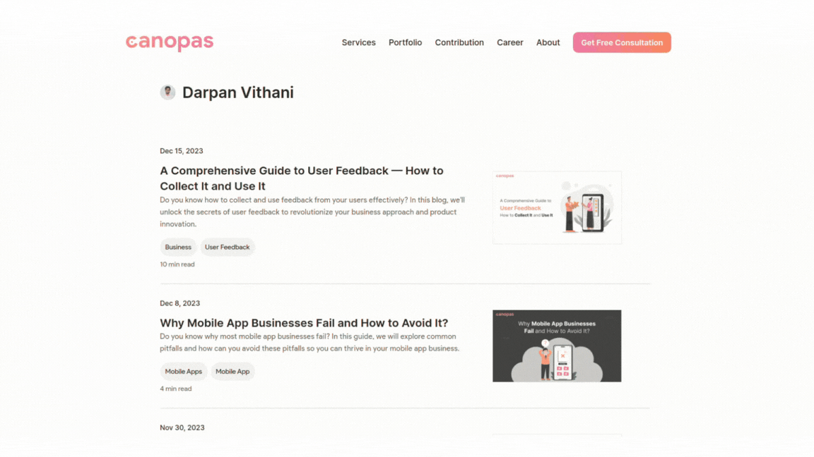

<p align="center"><a href="https://canopas.com/contact"></a></p>

# Nuxt Blog Kit

`Nuxt Blog Kit` is a component library for [**blogs website**](https://canopas.com/blog).

## About

The `nuxt-blog-kit` is an open-source library developed and maintained by Canopas. It is developed using `Nuxt 3` framework and `tailwindcss`. For preview visit [**_canopas blogs page_**](https://canopas.com/blog) .

## Showcase

#### Blogs List

<p align="center"><a href="https://canopas.com/resources"></a></p>

#### Blogs Detail

<p align="center"><a href="https://canopas.com/resources"></a></p>

#### Blogs by Tag

<p align="center"><a href="https://canopas.com/tag/mobile-app"></a></p>

#### Blogs by Author

<p align="center"><a href="https://canopas.com/author/Darpan"></a></p>

## Prerequisites

For integrating `nuxt-blog-kit` into your project, please ensure that `tailwindcss` is installed and properly configured within your project environment.

## Quick Setup

1. Add `nuxt-blog-kit` dependency to your project .

### Using yarn :

```bash
yarn add --dev @canopassoftware/nuxt-blog-kit
```

### Using npm :

```bash
npm install --save-dev @canopassoftware/nuxt-blog-kit
```

<br>

1. Add `nuxt-blog-kit` to the `modules` of `nuxt.config.ts`

```js
export default defineNuxtConfig({
  modules: ["@canopassoftware/nuxt-blog-kit"],
});
```

That's it! You can now use module in your Nuxt app ✨

[Read full documentation of all components](https://github.com/canopas/nuxt-blog-kit/blob/master/COMPONENTS.md)

## Contribution

The Canopas team enthusiastically welcomes contributions and project participation! There are a bunch of things you can do if you want to contribute! The [Contributor Guide](CONTRIBUTING.md) has all the information you need for everything from reporting bugs to contributing entire new features. Please don't hesitate to jump in if you'd like to, or even ask us questions if something isn't clear.

# Credits

This repository is owned and maintained by the [Canopas team](https://canopas.com/). If you are interested in building web applications or designing products, please let us know. We'd love to hear from you!

<a href="https://canopas.com/contact"></a>

# LICENSE

This repository licenced under [MIT](https://github.com/canopas/nuxt-blog-kit/blob/master/LICENSE).
